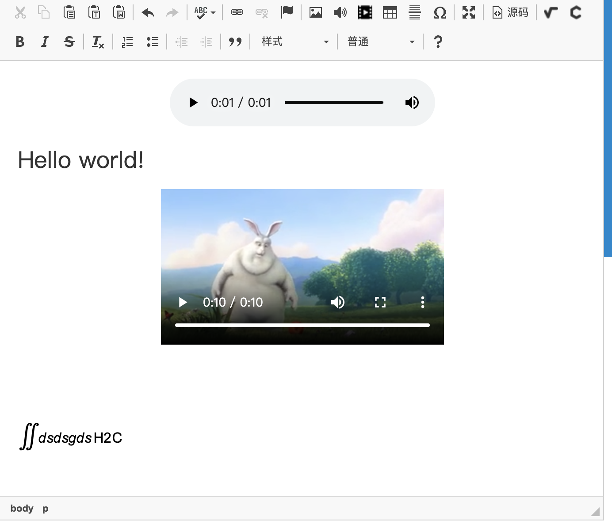

CKEditor 4
==========

效果如下：

## Documentation

The full editor documentation is available online at the following address:
https://ckeditor.com/docs/

## Installation

Installing CKEditor is an easy task. Just follow these simple steps:

 1. **Download** the latest version from the CKEditor website:
    https://ckeditor.com. You should have already completed this step, but be
    sure you have the very latest version.
 2. **Extract** (decompress) the downloaded file into the root of your website.

**Note:** CKEditor is by default installed in the `ckeditor` folder. You can
place the files in whichever you want though.

## Checking Your Installation

The editor comes with a few sample pages that can be used to verify that
installation proceeded properly. Take a look at the `samples` directory.

To test your installation, just call the following page at your website:

	http://<your site>/<CKEditor installation path>/samples/index.html

For example:

	http://www.example.com/ckeditor/samples/index.html
